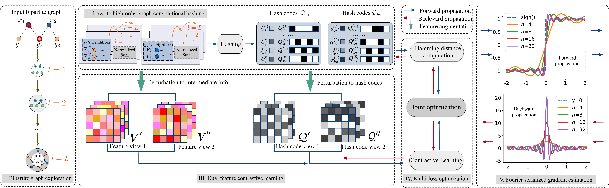

## Towards Effective Top-N Hamming Search via Bipartite Graph Contrastive Hashing



This repository provides the PyTorch implementation for our TKDE'24 paper [[BGCH+](https://arxiv.org/pdf/2408.09239)].


## 🔧 Requirements

The codes are built with the following main dependencies:


* `pytorch=1.8.1`
* `pandas`
* `scipy`
* `numpy`
* `tensorboardX`
* `scikit-learn`
* `tqdm`
* `pybind11`
* `cppimport`


## 🚀 Usage

To training/evaluating our model, please execute the command of the specific dataset, as shown in sota_settings.py

## 📄 Citation

If you find our work useful in your research, please consider citing our paper:

```bibtex
@article{chen2024towards,
  title={Towards Effective Top-N Hamming Search via Bipartite Graph Contrastive Hashing},
  author={Chen, Yankai and Fang, Yixiang and Zhang, Yifei and Ma, Chenhao and Hong, Yang and King, Irwin},
  journal={IEEE Transactions on Knowledge and Data Engineering},
  year={2024},
  publisher={IEEE}
}
```